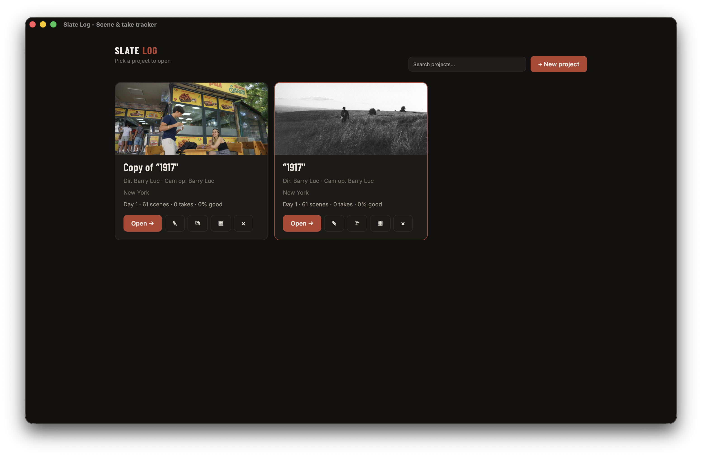
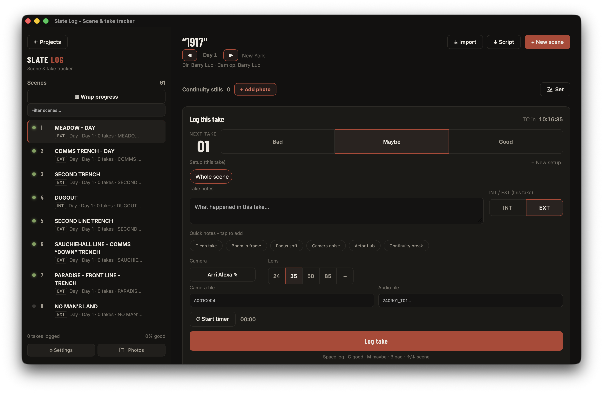
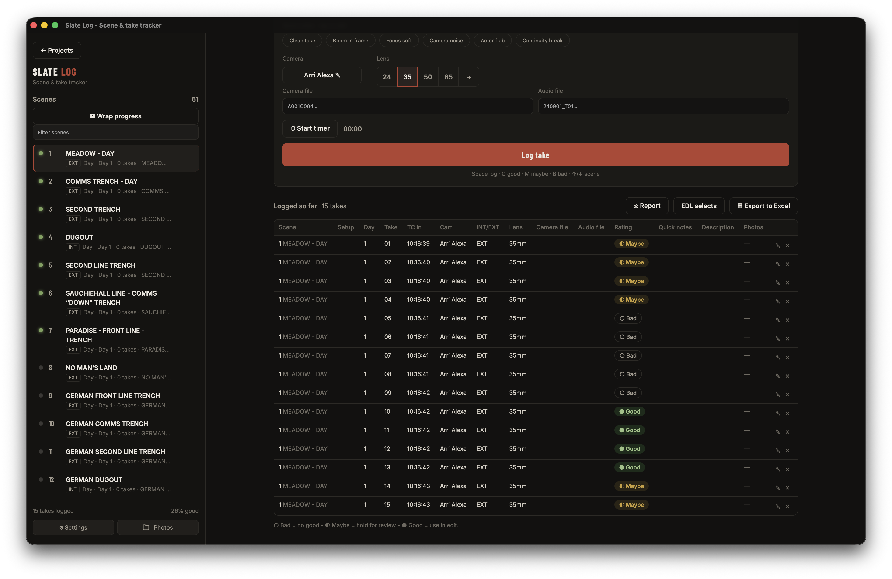
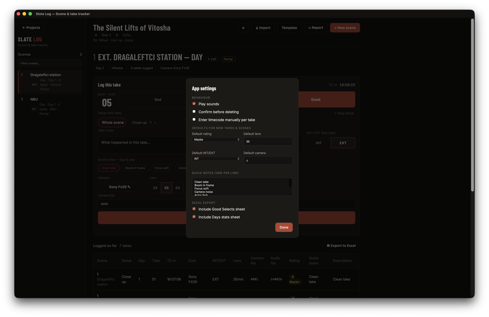
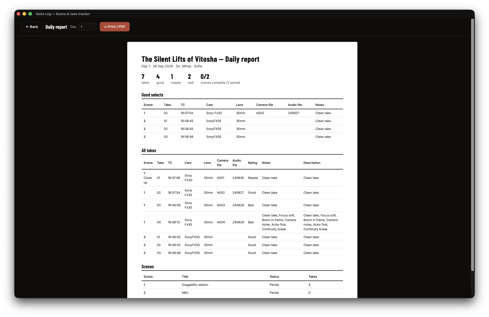
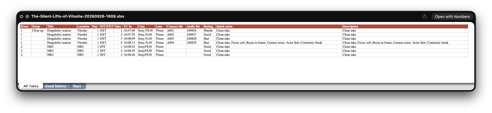

# Slate Log

Lightweight, offline-first scene & take tracker for film shoots. Mac (Apple Silicon + Intel), Windows and Linux from one Rust codebase.

- Projects home screen (DaVinci-style picker), per-project scenes, **setups & takes**
- Fast take logging: Bad / Maybe / Good, camera, lens (presets + custom), INT/EXT, shoot day, timecode (auto or manual), **stopwatch durations**, camera + audio filenames with auto-increment, quick notes
- **Continuity stills** per scene (thumbnails, lightbox, captions, contact sheet in the report)
- Scene status (Not shot / Partial / Complete) + **wrap progress board**
- **CSV scene import** (with template), **screenplay PDF import** (auto scene list with review), **daily report** view (print / save as PDF)
- SQLite storage on your machine - no account, no cloud, works offline on set
- Exports: Excel (All Takes, Good Selects, per-day stats), **PDF daily log**, **EDL selects timeline** (Resolve / Premiere / Avid)
- **📷 Set mode**: phones on the set WiFi scan a QR and push continuity stills + quick takes live - no install, no accounts, no internet

Built with [Tauri v2](https://tauri.app/) (Rust backend, vanilla JS frontend). 3.7MB .dmg, ~5MB installed.

## Screenshots

| Project picker | Logging takes |
|---|---|
|  |  |

| Takes table | Settings |
|---|---|
|  |  |

| Daily report | Excel export |
|---|---|
|  |  |

## Run in dev

```zsh
npm install
npm run tauri dev
```

## Build installers

```zsh
npm run tauri build
```

Output lands in `src-tauri/target/release/bundle/` (`.dmg`/`.app` on Mac, `.msi`/`.exe` on Windows, `.AppImage`/`.deb` on Linux).
Grab the latest ready-made builds from [Releases](../../releases):

| Your machine | Download this file |
|---|---|
| Mac with Apple Silicon (M1/M2/…) | `Slate.Log_X.Y.Z_aarch64.dmg` |
| Mac with Intel chip | `Slate.Log_X.Y.Z_x64.dmg` |
| Windows 10/11 | `Slate.Log_X.Y.Z_x64-setup.exe` |
| Linux (Debian/Ubuntu/…) | `slate-log_X.Y.Z_amd64.AppImage` (or the `.deb`) |

> First launch on Mac: the app isn't Apple-signed yet, so right-click it → **Open** → **Open** once. After that it launches with a double-click like anything else.
> First run on Windows: allow Slate Log through the **Windows Firewall** prompt, otherwise phones can't reach Set mode.

> First launch on Mac: the app isn't Apple-signed yet, so right-click it → **Open** → **Open** once. After that it launches with a double-click like anything else.
